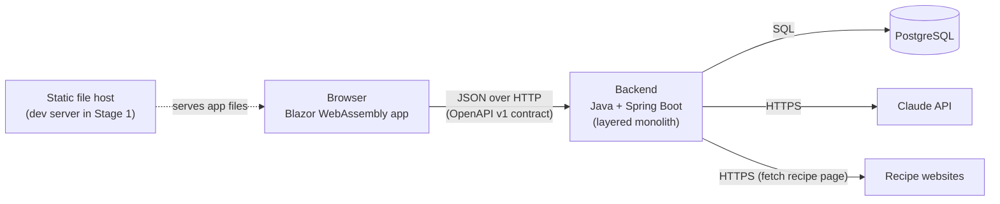
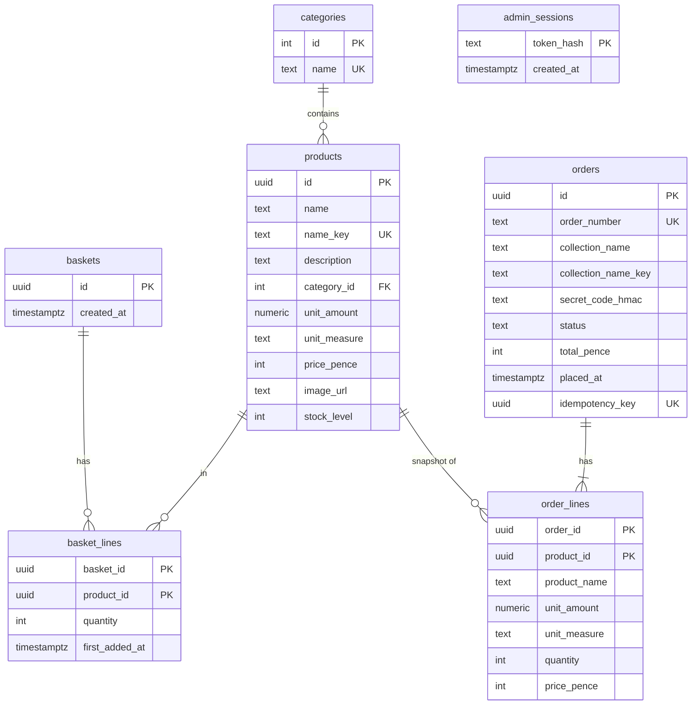
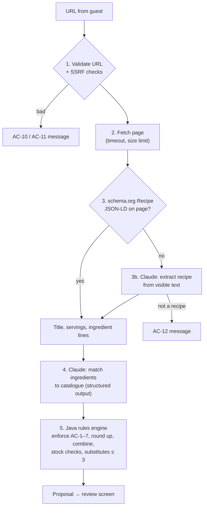

# 000 — Architecture Plan (Stage 1)

> **Status:** ✅ Agreed (2026-09-24), Amendment 1 (CI) 2026-09-24
> **Stage:** 1, layered monolith (constitution roadmap)
> **Implements:** specs 000–006
> **Last updated:** 2026-09-24

This is the **how** for the whole Stage 1 system. It follows the [constitution](../../constitution.md) and implements the [specs](../). Each significant choice is recorded as an **ADR** in §11, giving the decision, the alternatives and the reason. Later stages **supersede** ADRs rather than rewriting them.

Feature plans (`specs/00N-*/plan.md`) are short. They list the endpoints, tables and screens for their feature and refer back here for anything cross-cutting.

---

## 1. System overview



- **Two runnable parts** (Article IV): the **backend** and the **frontend**. Each starts with one command.
- The frontend is **static files** once built. It holds no server-side state (Article V).
- The backend is **stateless**. Everything lasting is in PostgreSQL.

---

## 2. Technology stack

| Part | Choice | Notes |
|---|---|---|
| Backend language | **Java 25 (LTS)**: Eclipse Temurin **25.0.4** | New to Rob, and the main learning goal (ADR-002) |
| Backend framework | **Spring Boot 4.1** (4.1.1 at setup) | Web, Security, Data JPA, Validation, Actuator |
| Build | **Maven** (with wrapper) | ADR-015 |
| Contract | **OpenAPI 3.1**, `contracts/openapi.yaml` | Server interfaces **and** frontend client are generated from it (ADR-013, ADR-014) |
| Database | **PostgreSQL 18** (18.6 at setup) | Schema managed by **Flyway** migrations (ADR-004) |
| Frontend | **Blazor WebAssembly** (.NET 10 LTS, SDK 10.0.302 / runtime 10.0.12 at setup), standalone | Not Blazor Server, for Article V (ADR-003) |
| AI | **Claude API**, official **Anthropic Java SDK** | Model chosen by the evaluation (ADR-012) |
| HTML parsing | **jsoup** | Reading recipe pages (ADR-011) |
| Backend tests | **JUnit 5**, **Mockito**, **AssertJ** | Unit tests |
| API-level tests | **JUnit 5** + **REST Assured**, in a separate `api-tests` project | Black-box and structure-independent (ADR-016) |
| Frontend tests | **bUnit** + **xUnit** | Component unit tests |

*Versions checked on 2026-09-24 (T-002) against endoflife.date and winget. Minor and patch updates within these lines are fine. Moving to a new major line (e.g. Spring Boot 5) is a new ADR. Library versions (jsoup, NSwag, openapi-generator, etc.) are pinned in the build files when each is added.*

---

## 3. Repository layout

```
ingredient-shopper/
├── constitution.md
├── backlog.md
├── specs/                     ← specs, plans and tasks
├── contracts/
│   ├── openapi.yaml           ← THE contract (v1)
│   └── CHANGELOG.md           ← Article IIIa
├── backend/                   ← Spring Boot app (Maven)
│   └── src/main/java/com/glendas/shopper/
│       ├── controller/        ← HTTP layer: implements generated API interfaces
│       ├── service/           ← business rules (clamp rule, order placement, recipe proposals…)
│       ├── repository/        ← Spring Data JPA repositories
│       ├── entity/            ← JPA entities
│       ├── client/            ← outbound: Claude API, recipe page fetcher
│       ├── security/          ← admin session filter, password checking
│       └── config/            ← configuration binding, CORS
│   └── src/main/resources/db/
│       ├── migration/         ← Flyway: schema (always)
│       └── seed/              ← Flyway: demo catalogue (dev only, ADR-017)
├── api-tests/                 ← black-box API tests (Maven, separate project)
├── eval/                      ← 006 evaluation recipes + runner
└── frontend/                  ← Shopper.slnx
    ├── Shopper.Web/           ← Blazor WebAssembly app
    │   ├── Pages/  Layout/  Services/
    │   └── Api/Generated/     ← generated client (from contracts/openapi.yaml, git-ignored)
    └── Shopper.Web.Tests/     ← xUnit + bUnit
```

**Packages are organised by technical layer**, as Article I requires. `service/` contains `ProductService`, `BasketService`, `OrderService` and so on side by side. Reorganising these into business modules is Rob's Stage 2 exercise, so this plan deliberately doesn't do it.

---

## 4. Data model (PostgreSQL, one database, one schema)



**Constraints enforced by the database** (so a bug can't break them):

| Rule | Constraint | Spec |
|---|---|---|
| Stock never negative | `CHECK (stock_level >= 0)` | 000 §4.3, 004 AC-30 |
| Unique names, ignoring case and spaces | `name_key` = lower(trim(name)), `UNIQUE` | 004 AC-14 |
| Positive price, max £9,999.99 | `CHECK (price_pence BETWEEN 1 AND 999999)` | 004 field rules |
| Measure from the fixed list | `CHECK (unit_measure IN ('g','kg','ml','l','each'))` | 000 glossary |
| Quantity ≥ 1 | `CHECK (quantity >= 1)` | 002 terms |
| One line per product per basket | primary key `(basket_id, product_id)` | 002 terms |
| No duplicate orders | `UNIQUE (idempotency_key)` | 003 AC-22 |
| Valid status | `CHECK (status IN ('PLACED','READY_FOR_COLLECTION','COLLECTED'))` | 003 terms |

---

## 5. API overview (contract v1)

The full detail lives in `contracts/openapi.yaml`, written in the first tasks. All paths are prefixed `/v1` (Article IIIa).

### Public
| Method & path | Purpose | Spec |
|---|---|---|
| `GET /v1/categories` | Fixed category list, alphabetical | 001 AC-10 |
| `GET /v1/products?category=&search=&page=` | Filtered, sorted, paginated product summaries (10 per page) | 001 AC-1–22 |
| `GET /v1/products/{id}` | Product detail, including stock level | 001 AC-23–27 |
| `POST /v1/baskets` | Create an empty basket and return its ID | 002 AC-3 |
| `GET /v1/baskets/{id}` | Read the basket (lines, totals, count). **No changes made** | 002 AC-10–17 |
| `POST /v1/baskets/{id}/reconcile` | Apply the **clamp rule** and return the basket plus adjustment messages | 002 AC-24–29 |
| `POST /v1/baskets/{id}/lines` | Add a product and quantity (capped, with a message) | 002 AC-3–8 |
| `POST /v1/baskets/{id}/lines/bulk` | Add many lines at once (recipe import), with the clamp rule | 006 AC-29–31 |
| `POST /v1/baskets/{id}/lines/{productId}/increment` · `/decrement` | + / −, with the clamp rule | 002 AC-18–20, 27–28 |
| `DELETE /v1/baskets/{id}/lines/{productId}` | Remove a line | 002 AC-21 |
| `DELETE /v1/baskets/{id}/lines` | Clear the basket | 002 AC-22 |
| `POST /v1/orders` (header `Idempotency-Key`) | Place an order. `201` confirmation, `409` with clamp adjustments, or `422` validation errors | 003 |
| `POST /v1/recipe-imports` | URL → proposal for the review screen (**not stored**) | 006 |
| `POST /v1/auth/login` · `POST /v1/auth/logout` · `GET /v1/auth/me` | Admin session | 004 AC-1–7 |

### Admin (require an admin session, otherwise `401`)
| Method & path | Purpose | Spec |
|---|---|---|
| `POST /v1/admin/products` · `PUT /v1/admin/products/{id}` | Create or edit a product (no stock field on edit) | 004 AC-13–24 |
| `POST /v1/admin/products/{id}/stock-adjustments` | Relative adjustment. `409` with the current level if it would go negative | 004 AC-25–31 |
| `GET /v1/admin/orders?status=&page=` | Orders list, sorted by status order, then newest first | 005 AC-4–11 |
| `POST /v1/admin/orders/lookup` | Collection lookup by name and code (POST, so the code stays out of URLs and logs) | 005 AC-15–22 |
| `PUT /v1/admin/orders/{id}/status` | Set any status | 005 AC-23–27 |

**Why `reconcile` is separate from `GET`:** by HTTP convention, `GET` must never change anything. The header's basket count calls `GET` on every page. The basket page calls `reconcile` when it loads, which is where the clamp rule belongs (002 AC-24).

**Order responses never contain the secret code.** The code isn't even stored in readable form (ADR-010, 005 AC-12a).

---

## 6. Cross-cutting decisions

| Topic | Decision | ADR |
|---|---|---|
| **Money** | Stored and sent as **integer pence** (`pricePence: 120`). Formatted as £1.20 only in the frontend. Never floating point. | 005 |
| **Basket identity** | The server creates a random **UUID** basket ID. The browser keeps it in `localStorage`. Being unguessable, the ID works as the guest's key. | 007 |
| **Admin auth** | Username + **bcrypt**-hashed password from configuration. Login returns a random **session token**, stored **hashed** in `admin_sessions`, and sent as `Authorization: Bearer`. Logout deletes the row. No expiry (004 §6). | 006 |
| **Authorisation** | A Spring Security filter protects `/v1/admin/**`. Enforced on the **server**, regardless of what the UI shows (004 AC-8). | 006 |
| **Stock on order** | **One database transaction**: clamp check, then a conditional decrement per line (`UPDATE … SET stock_level = stock_level - :q WHERE id = :id AND stock_level >= :q`). If any line affects 0 rows, the transaction rolls back and the clamp result is returned (`409`). | 008 |
| **Stock adjustments** | Relative, using the same conditional-update pattern, so they never lose a concurrent sale (004 AC-28). | 008 |
| **Duplicate orders** | The frontend creates an **Idempotency-Key** per attempt. A repeated key returns the original order. | 009 |
| **Secret codes** | Stored as an **HMAC-SHA256** of the lowercased code, keyed by a server secret. Lookup computes the HMAC and matches exactly, so the code is never stored or returned in plain text. | 010 |
| **Order numbers** | From a PostgreSQL sequence, formatted like **`GG-1042`**: short, and easy to read aloud (003 §4). | — |
| **Name lookup** | `collection_name_key` = lower(trim(name)), matched exactly (005 AC-16/17). | — |
| **Search** | `name_key LIKE %term%`, with `%` and `_` **escaped** (001 edge cases). Sorted by `name_key`. | — |
| **Errors** | One JSON error shape (RFC 9457 "problem details") with field-level messages for validation (004 AC-13). | — |
| **Configuration** | Environment variables only (Article V). See §9. | — |
| **Health** | Spring Actuator `GET /actuator/health` (Article V). The frontend's health is simply its static file being served. | — |
| **CORS** | The backend allows the frontend's origin (from config). In Stage 4, a reverse proxy could put both on one origin. | — |

---

## 7. Recipe import design (006)

The riskiest feature, so it gets the most design. The key idea: **the AI suggests, deterministic code decides.** All the hard rules (006 AC-1–7) are enforced by Java code *after* the AI responds. They never rely on the AI obeying instructions.



1. **Validate and protect (SSRF).** The server fetches a URL that a *stranger* typed in, which is a classic attack route. It could be pointed at `localhost:5432` or cloud metadata addresses. So: only `http`/`https`, resolve the host and **reject private, loopback and link-local addresses** (including after redirects), allow at most 3 redirects, time out after **10 s**, and read at most **2 MB**.
2. **Fetch** with Java's `HttpClient`.
3. **Extract.** Most recipe sites embed a machine-readable **schema.org `Recipe`** block (JSON-LD) with the title, servings and ingredient lines. We parse it with jsoup: it's free, fast and exact. Only if it's missing do we ask Claude to extract the recipe from the page's visible text (truncated), which also detects "not a recipe" (AC-12).
4. **Match.** One Claude call receives the ingredient lines and the **whole catalogue** (about 50 products, which fits easily: id, name, unit, category, in stock yes/no). It returns **structured JSON** for each ingredient: matched product ID or none, needed amount converted to that product's measure, skip reason, `essential` flag, and ranked substitute IDs. The page's content is passed as clearly delimited **data**, and the AI has **no tools**. It can only return this JSON (AC-6).
5. **Rules engine (plain Java, fully unit-tested).** It discards unknown IDs (AC-4), removes excluded staples by a fixed list (AC-7), drops out-of-stock products (AC-2), combines lines for the same product (AC-19), rounds up to whole products (AC-16–18), caps at stock (AC-5), applies the partial-stock choice (AC-25), keeps at most 3 in-stock substitutes (AC-24), and raises the essential-unavailable warning (AC-28).

- **Overall time limit: 60 s** (AC-13).
- **Nothing is stored.** The proposal is returned to the browser, and "Add to basket" sends the chosen lines to `POST /v1/baskets/{id}/lines/bulk` (AC-29–34).

---

## 8. Frontend design (Blazor WebAssembly)

| Page | Route | Specs |
|---|---|---|
| Product list (with category filter, search, pagination) | `/` | 001, 004 AC-9 |
| Product detail (with add to basket, and admin controls) | `/products/{id}` | 001, 002, 004 |
| Product form (create/edit, admin) | `/admin/products/new`, `/admin/products/{id}/edit` | 004 |
| Basket (with order form) | `/basket` | 002, 003 |
| Order confirmation | `/orders/confirmation` | 003 AC-23–25 |
| Recipe import and review | `/recipes` | 006 |
| Login | `/login` | 004 |
| Orders (admin) | `/admin/orders` | 005 |

- **Header component** on every page: basket count (002 AC-10), links to Recipe import, Log in/Log out, and Orders for the admin.
- **Filters and page live in the URL** (e.g. `/?category=dairy&search=milk&page=2`). "Back" from a product then restores the list exactly (001 AC-26), with no extra state.
- **Browser storage:** basket ID and admin token in `localStorage`. The confirmation is held **in memory** only, so it's gone after leaving or reloading (003 AC-25).
- **The API client** is generated from `contracts/openapi.yaml` with **NSwag** (ADR-014).
- **Admin controls** are hidden for guests, for convenience only. Security is on the server (§6).

---

## 9. Configuration

| Variable | Used by | Purpose |
|---|---|---|
| `DB_URL`, `DB_USER`, `DB_PASSWORD` | backend | PostgreSQL connection |
| `ADMIN_USERNAME`, `ADMIN_PASSWORD_BCRYPT` | backend | The single admin account (000 §5.1) |
| `SECRET_CODE_HMAC_KEY` | backend | Key for secret code HMACs (ADR-010) |
| `ANTHROPIC_API_KEY`, `ANTHROPIC_MODEL` | backend | Claude API (ADR-012) |
| `CORS_ALLOWED_ORIGINS` | backend | The frontend's address |
| `SERVER_PORT` | backend | Port to listen on |
| `SEED_DEMO_DATA` | backend | `true` loads the demo catalogue (ADR-017). Default `false` |
| `ApiBaseUrl` (in `wwwroot/appsettings.json`) | frontend | Where the backend is |

A `.env.example` documents these. **Real secrets are never committed.**

---

## 10. Testing strategy (Article IX)

| Level | Where | What | Runs |
|---|---|---|---|
| **Unit** | `backend/src/test` | Services and the recipe rules engine, with the Claude client **mocked** | Every build |
| **Unit** | `frontend.Tests` (bUnit) | Components: basket display, filters, validation messages | Every build |
| **API-level** | `api-tests/` | **Black-box**: only calls `BASE_URL` over HTTP. It sets up data **through the API** (e.g. creates products as admin), never through the database. Each test is named after its AC (e.g. `ac004_28_adjustmentDoesNotUndoConcurrentSale`). **Contract validation** is built in: every response is checked against `openapi.yaml`. | Against a running backend and a test database |
| **AI evaluation** | `eval/` | The 006 §4 example recipes, run against the **real** Claude API, comparing proposals with the expected lines | **Manually** (it costs money) |

### Continuous integration *(Amendment 1, 2026-09-24)*
A **GitHub Actions** workflow runs on every PR and every push to `main`:

| Job | Steps |
|---|---|
| `contract` | Lint `contracts/openapi.yaml` (Redocly) *(added in T-008)* |
| `backend` | Build (including code generation from the contract) and run unit tests |
| `frontend` | Build (including NSwag client generation) and run bUnit tests |
| `api-tests` | Start **PostgreSQL** (a GitHub Actions *service container*), start the backend with `SEED_DEMO_DATA=true`, then run `api-tests` against it |

All four must pass before a PR can merge (Article XII). The AI evaluation (`eval/`) **isn't** run in CI, because it calls the paid Claude API. *(The service container is only for CI. Running the app locally still needs no containers, per Article IV.)*

**Why API tests set up data through the API:** in Stages 2 and 3 the database gets split up and restructured. Tests that insert rows directly would break, while tests that only use the API keep working, which is exactly the safety net Article IX asks for. In Stage 3, `BASE_URL` points at whatever sits in front of the services, and the **same tests** run unchanged.

**Recipe pages for the evaluation** are **saved as local HTML files** in `eval/`, so results don't change when a live site does. The fetcher is pointed at a local file server for those runs.

---

## 11. Architecture Decision Records (ADRs)

*Format: Decision · Alternatives · Why. Later stages add new ADRs that supersede these.*

| ADR | Decision | Alternatives considered | Why |
|---|---|---|---|
| **001** | **Layered monolith** for Stage 1 | Modular monolith; microservices | Constitution roadmap. Rob modularises it in Stage 2 |
| **002** | **Java + Spring Boot** backend | FastAPI (Python), Go, Ruby | Rob's top learning goal. Close enough to C# to fit the timebox. Official Claude Java SDK. FastAPI is a Stage 5 candidate |
| **003** | **Blazor WebAssembly** frontend | Blazor Server, React, HTMX | Blazor Server keeps UI state in server memory, which breaks Article V. HTMX needs server-rendered HTML, which clashes with the JSON contract. Rob knows Blazor and C#, so the learning budget goes to Java |
| **004** | **PostgreSQL + Flyway** | SQLite, MongoDB | Atomic conditional updates and transactions. Schemas help in Stage 2. Flyway makes migrations reviewable |
| **005** | Money as **integer pence** | Floating point; decimal | Floats give rounding errors (0.1 + 0.2). Integers are exact and easy to send in JSON |
| **006** | **DB-backed opaque admin sessions** (bearer token) | JWT; cookie sessions; OIDC now | Revocable on logout (a JWT isn't, without extra state). Stateless app, since the state is in the DB. Simple to replace with OIDC later. **Stage 3 note:** with several services, each would have to ask an auth service "is this token valid?" on every request. That's the point where **JWTs** (e.g. from OIDC), which each service can check by itself, become the better choice |
| **007** | **UUID basket ID** in `localStorage` | Cookie; accounts | Works for guests with no accounts. Unguessable. Easy to attach to accounts later |
| **008** | **Conditional updates in one transaction** for stock | Optimistic locking; row locks; a queue | The simplest correct answer to "the last loaf" (003 AC-15). **Stage 3 note:** once stock and orders are in separate services, this becomes a **saga** |
| **009** | **Idempotency key** on order placement | Disabling the button only | The UI alone can't stop duplicate requests (003 AC-22) |
| **010** | **HMAC** of secret codes | Plain text; bcrypt | Never readable (005 AC-12a). Unlike bcrypt, HMAC is deterministic, so exact lookup works |
| **011** | Recipe: **schema.org JSON-LD first, Claude as fallback**; **Java enforces the rules** | AI does everything | Cheaper, faster and exact where structured data exists. The hard rules can't be bypassed by the AI or a malicious page |
| **012** | **Claude model chosen by evaluation**: start with **Claude Haiku 4.5**, and move to **Claude Sonnet 5** only if the evaluation fails | Always the largest model | Matching roughly 20 lines against 50 products is a modest task. The cheaper, faster model helps the 60 s limit |
| **013** | **Server interfaces generated** from OpenAPI (openapi-generator, `spring`, interfaces only) | Writing controllers by hand; generating the spec from code | True contract-first: the backend fails to compile if it drifts from the contract |
| **014** | **NSwag** for the frontend client | Kiota; handwritten | Simpler output. Compile-time contract checking for the frontend |
| **015** | **Maven** | Gradle | The most common choice in Spring guides and tutorials, so it's easier while learning |
| **016** | **Black-box `api-tests` project** | `@SpringBootTest` inside the backend | Independent of the backend's code and structure, so it survives Stages 2–5 unchanged |
| **017** | **Seed data is dev-only**: a separate Flyway location (`db/seed`), loaded only when `SEED_DEMO_DATA=true`. Seed files are **repeatable** migrations (`R__*.sql`, idempotent upserts) *(detail added in T-005)* | Seed as a normal migration; versioned (`V__`) seed files | The schema is needed everywhere, but demo stock isn't. Repeatable migrations run **after** all versioned ones, so the tables exist, and they share no version numbers with the schema. They re-run when edited, so the demo catalogue can grow |
| **018** | **GitHub Actions CI**, required on every PR *(Amendment 1)* | No CI; another CI service | Catches broken builds before merge. Free for public repos. It lives next to the Issues and PRs |

---

## 12. Risks

| Risk | Impact | Mitigation |
|---|---|---|
| **AI match quality** is poor | 006 is unconvincing | Evaluation set; show the original ingredient text; the review screen is the safeguard; upgrade the model (ADR-012) |
| **Recipe sites block bots** or lack JSON-LD | Imports fail | Claude fallback; choose demo recipes from sites that work; clear error messages |
| **SSRF / malicious pages** | Security | §7 step 1 checks; the AI has no tools; the rules engine validates everything |
| **Java/Spring learning curve** | Timebox | AI writes Stage 1, and Rob reviews and asks. Similarities to C# help |
| **Claude API cost** | Money | Haiku first; one call per import (two at most); evaluation run manually |
| **Blazor WebAssembly first-load size** | Slow first visit | Acceptable for a portfolio. Could be improved later |

---

## 13. What happens next

1. Rob reviews this plan, especially **§5 (API)**, **§7 (recipe import)** and the **ADRs**.
2. **Short feature plans** for 001–006 (endpoints, tables, screens, and anything feature-specific).
3. **`tasks.md`**, starting with project setup and the contract, then features in dependency order.
4. Tasks become **GitHub Issues** on a Projects board.

---

## Open questions

1. **Anything in the ADR table you'd like to challenge?** This is the best moment. Changing an ADR costs one line now, and a refactor later.
