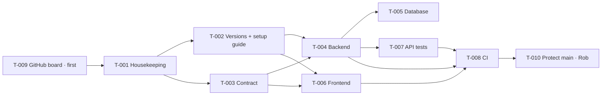

# 000 — Setup Tasks (Stage 1)

> **Status:** ✅ Agreed (2026-09-24)
> **Implements:** [plan.md](plan.md) (architecture) and constitution Articles III–V, IX, XII
> **Last updated:** 2026-09-24

The groundwork every feature needs. When these are done, both runnable parts start with one command, the contract and code generation are wired up, the API test harness runs, and CI guards `main`. **No product features yet.**

Each task follows Article XII: one branch, one PR, CI must pass, and only Rob merges.

**Build order after setup** (from planning): **004 → 001 → 002 → 003 → 005 → 006**. The API tests create their data through 004's admin endpoints, so 004 comes first.

---

## Task list

| ID | Task | Owner | Depends on | Issue |
|---|---|---|---|---|
| T-001 | Repo housekeeping | AI | — | [#1](https://github.com/rob-barlow/ingredient-shopper/issues/1) |
| T-002 | Pin versions and write local setup guide | AI | T-001 | [#2](https://github.com/rob-barlow/ingredient-shopper/issues/2) |
| T-003 | Contract skeleton | AI | T-001 | [#3](https://github.com/rob-barlow/ingredient-shopper/issues/3) |
| T-004 | Backend skeleton | AI | T-002, T-003 | [#4](https://github.com/rob-barlow/ingredient-shopper/issues/4) |
| T-005 | Database and Flyway, with fixed categories | AI | T-004 | [#5](https://github.com/rob-barlow/ingredient-shopper/issues/5) |
| T-006 | Frontend skeleton | AI | T-002, T-003 | [#6](https://github.com/rob-barlow/ingredient-shopper/issues/6) |
| T-007 | API test harness | AI | T-004 | [#7](https://github.com/rob-barlow/ingredient-shopper/issues/7) |
| T-008 | CI workflow | AI | T-004, T-006, T-007 | [#8](https://github.com/rob-barlow/ingredient-shopper/issues/8) |
| T-009 | GitHub project board, labels, milestones and issues | AI | — *(done first)* | [#9](https://github.com/rob-barlow/ingredient-shopper/issues/9) |
| T-010 | Protect `main` | **Rob** | T-008 | [#10](https://github.com/rob-barlow/ingredient-shopper/issues/10) |

*The Issue column is filled in when T-009 creates the issues. From then on, the **issue** is the live status (plan §13).*

---

## Task details

### T-001 · Repo housekeeping
**Owner:** AI · **Implements:** Article XII, plan §3, §9
- `README.md`: what the project is, a link to the specs, and "how to run" (filled in by T-002).
- `.gitignore` covering Java/Maven, .NET, IDEs and `.env`.
- `.editorconfig`.
- `.env.example` listing every variable in plan §9, with safe placeholder values.
- `.github/pull_request_template.md` with **Task**, **Implements (ACs)**, **Closes #**, **How to test** and a **checklist** (tests added, contract updated if needed, no secrets).

**Done when:** the files exist, `.env` is ignored by git, and a test PR shows the template.

### T-002 · Pin versions and write local setup guide
**Owner:** AI · **Implements:** plan §2, Article IV
- Check the **current** stable versions of Java 25, Spring Boot, .NET 10 and PostgreSQL, and record them in plan §2.
- `docs/local-setup.md`: installing the JDK, .NET SDK and PostgreSQL on Windows, creating the `shopper` and `shopper_test` databases, and filling in `.env`.

**Done when:** Rob can follow the guide on his machine from scratch and every tool reports its version.

### T-003 · Contract skeleton
**Owner:** AI · **Implements:** Article III, IIIa, plan §5, §6 (errors)
- `contracts/openapi.yaml`: `openapi: 3.1`, info, `/v1` server base path, the shared **Problem Details** error schema, and the `bearerAuth` security scheme. No feature endpoints yet. Those are added by each feature's tasks.
- `contracts/CHANGELOG.md` with a `v1.0.0 (unreleased)` entry.

**Done when:** the file passes an OpenAPI validator, and it's reviewed by Rob (it's the contract, so it matters).

### T-004 · Backend skeleton
**Owner:** AI · **Implements:** plan §2, §3, §6 (config, health, CORS, errors), ADR-013, ADR-015
- A Spring Boot Maven project in `backend/` with the Maven wrapper.
- Dependencies: Web, Security (permitting everything for now, locked down in 004), Data JPA, Validation, Actuator, PostgreSQL driver and Flyway.
- **openapi-generator** plugin generating **Spring interfaces** from `contracts/openapi.yaml` on every build.
- Empty **layer packages** (`controller`, `service`, `repository`, `entity`, `client`, `security`, `config`), per Article I.
- Configuration binding from environment variables. CORS from `CORS_ALLOWED_ORIGINS`. A global handler returning Problem Details.
- `GET /actuator/health` returns `UP`, including a database check.
- One sample unit test, so the test setup is proven.

**Done when:** `./mvnw spring-boot:run` (with `.env` loaded) starts the app, health returns `UP`, and `./mvnw test` passes.

### T-005 · Database and Flyway, with fixed categories
**Owner:** AI · **Implements:** plan §4, ADR-004, ADR-017, 000 §5.5
- Flyway configured with **two locations**: `db/migration` (always) and `db/seed` (only when `SEED_DEMO_DATA=true`).
- `V1__categories.sql`: the `categories` table and the **fixed category list**. This is reference data, so it goes in `migration`, not `seed`: categories are needed everywhere.
- The category list, agreed with Rob in this PR: e.g. Bakery, Dairy & Eggs, Fruit & Veg, Meat & Fish, Pantry, Frozen, Drinks, Snacks, Household.
- *Other tables are added by the features that need them (004 adds products, and so on). The demo catalogue seed arrives with 001.*

**Done when:** starting the backend on an empty database creates `categories` with the agreed list, and restarting doesn't duplicate anything.

### T-006 · Frontend skeleton
**Owner:** AI · **Implements:** plan §8, ADR-003, ADR-014, Article IV
- A standalone **Blazor WebAssembly** project in `frontend/`, and a **bUnit/xUnit** test project.
- The layout with a **header placeholder** (basket count, links added by later features).
- `ApiBaseUrl` read from `wwwroot/appsettings.json`.
- **NSwag** client generation from `contracts/openapi.yaml` on build, into `Api/`.
- A money formatting helper (`pence → "£1.20"`) with unit tests (000 §5.3, used everywhere).

**Done when:** `dotnet run` serves the app with the layout, `dotnet test` passes, and the generated client compiles.

### T-007 · API test harness
**Owner:** AI · **Implements:** Article IX, plan §10, ADR-016
- A separate Maven project in `api-tests/`: JUnit 5, REST Assured and AssertJ.
- `BASE_URL` from configuration. Nothing in it refers to backend code.
- **Contract validation**: every response is automatically checked against `contracts/openapi.yaml` (e.g. with a REST Assured OpenAPI validation filter).
- Naming convention: `acNNN_MM_description`, e.g. `ac004_28_adjustmentDoesNotUndoConcurrentSale`.
- A first test: `GET /actuator/health` returns `UP`.

**Done when:** `./mvnw test -DBASE_URL=http://localhost:8081` passes against a running backend.

### T-008 · CI workflow
**Owner:** AI · **Implements:** plan §10 (CI), ADR-018, Article XII
- `.github/workflows/ci.yml` running on PRs and pushes to `main`.
- `contract` job: lint `contracts/openapi.yaml` with Redocly *(added during T-008, as promised in `contracts/README.md`)*.
- `backend` job: JDK, `./mvnw verify`.
- `frontend` job: .NET SDK, `dotnet build` and `dotnet test`.
- `api-tests` job: a PostgreSQL **service container**, start the backend with `SEED_DEMO_DATA=true`, wait for health, then run `api-tests`.
- Maven and NuGet caching.

**Done when:** all three jobs pass on this PR, and deliberately breaking a test makes CI fail (demonstrated, then reverted).

### T-009 · GitHub project board, labels, milestones and issues
**Owner:** AI (using `gh`, with Rob's confirmation before creating anything) · **Done first**, so every later PR can close its issue
- **Labels:** `owner:ai`, `owner:rob`, `spec:000`–`spec:006`, `type:setup`, `type:feature`, `type:test`.
- **Milestones:** "Setup", "004 Admin inventory", "001 Browse", "002 Basket", "003 Place order", "005 Admin orders", "006 Recipe import".
- A **Projects board** with the columns To do, In progress, In review, Done.
- **An issue for each setup task**, linked to this file. The issue numbers are written back into the task list above.
- Feature issues are created as each feature's `tasks.md` is agreed.

**Done when:** the board shows every setup task, labelled and in the right milestone.

### T-010 · Protect `main`
**Owner:** **Rob** · **Implements:** Article XII
- In the GitHub repo settings, add a **branch protection rule** (or ruleset) for `main`: require a pull request, require the CI status checks (`contract`, `backend`, `frontend`, `api-tests`) to pass, and block direct pushes.
- *Don't* require an approving review. On a solo repo you're the PR author, and authors can't approve their own PRs.
- The AI can explain each setting as you go.

**Done when:** a direct push to `main` is rejected, and a PR with failing CI can't be merged.

---

## Order at a glance

