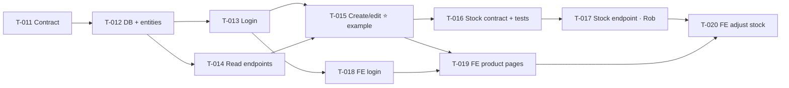

# 004 — Admin: Inventory & Stock · Tasks

> **Status:** Draft
> **Implements:** [plan.md](plan.md) · [spec.md](spec.md)
> **Last updated:** 2026-10-01

Each task: one branch (`t-NNN-…`), one PR, CI green, Rob merges (Article XII). Task numbers continue from setup (T-001 to T-010).

---

## Task list

| ID | Task | Owner | Depends on | Issue |
|---|---|---|---|---|
| T-011 | Contract: auth, catalogue and admin product endpoints | AI | — | |
| T-012 | Migrations V2/V3, entities and repositories | AI | T-011 | |
| T-013 | Admin login and the security filter | AI | T-012 | |
| T-014 | Categories and product read endpoints | AI | T-012 | |
| T-015 | Create and edit product endpoints · **Rob's worked example** | AI | T-013, T-014 | |
| T-016 | Stock adjustment contract, plus **API tests first (disabled)** | AI | T-015 | |
| T-017 | **Stock adjustment endpoint** | **Rob** | T-016 | |
| T-018 | Frontend: admin session, login page and header | AI | T-013 | |
| T-019 | Frontend: product detail page, product form and Add product | AI | T-015, T-018 | |
| T-020 | Frontend: Adjust stock control | AI | T-017, T-019 | |

---

## Task details

### T-011 · Contract: auth, catalogue and admin product endpoints
**Owner:** AI · **Implements:** plan §2 · Article III, IIIa
- Add to `openapi.yaml`, with the tags `auth`, `catalogue` and `admin`:
  - `login`, `logout`, `getCurrentAdmin`
  - `listCategories`, `getProduct`
  - `createProduct`, `updateProduct`
- Schemas: `LoginRequest`, `LoginResult`, `AdminInfo`, `Category`, `ProductDetail`, `ProductInput`, `NewProduct`, with the validation rules from spec §3 written in wherever OpenAPI can express them.
- Every admin operation declares `bearerAuth`. Every public one declares `security: []`.
- CHANGELOG entry.

**Done when:** the lint passes, and the backend and frontend still build. The new generated interfaces compile, and nothing implements them yet. **Rob reviews the contract.**

### T-012 · Migrations V2/V3, entities and repositories
**Owner:** AI · **Implements:** plan §3, §4 (`entity/`, `repository/`)
- `V2__products.sql` (with the generated `name_key UNIQUE`, and all the CHECK constraints) and `V3__admin_sessions.sql`.
- `CategoryEntity`, `ProductEntity` (`name_key` mapped read-only) and `AdminSessionEntity`.
- `CategoryRepository`, `ProductRepository` and `AdminSessionRepository`.

**Done when:** the backend starts on a fresh database, Flyway applies V2 and V3, and Hibernate's `validate` accepts the entities. CI is green.

### T-013 · Admin login and the security filter
**Owner:** AI · **Implements:** 004 AC-2–4, AC-7, AC-8 (API side) · plan §4 "Admin login" · ADR-006
- `ShopperProperties.admin` (`ADMIN_USERNAME`, `ADMIN_PASSWORD_BCRYPT`).
- `AuthService`: bcrypt always runs (so timings are equal), a 32-byte `SecureRandom` token, and a SHA-256 hash stored.
- `AdminSessionFilter`, `ProblemAuthenticationEntryPoint`, and a `SecurityConfig` that locks `/v1/admin/**`, `/v1/auth/logout` and `/v1/auth/me`.
- `AuthController implements AuthApi`.
- **CI:** the `api-tests` job gets `ADMIN_USERNAME`, `ADMIN_PASSWORD_BCRYPT` and `-DADMIN_PASSWORD` (CI-only values).
- **API tests:** an `AdminLogin` helper, plus `ac004_2_correctCredentialsGiveAToken`, `ac004_3_wrongUsernameOrPasswordGiveTheSameMessage`, `ac004_4_emptyFieldsAreRejected`, `ac004_7_logoutKillsTheToken`, `ac004_8_noTokenOrABadTokenIsRefused`.

**Done when:** the unit tests for `AuthService` and the filter pass, the API tests above pass in CI, and the setup guide explains generating the admin bcrypt hash (already there) and logging in.

### T-014 · Categories and product read endpoints
**Owner:** AI · **Implements:** (001 AC-10), (001 AC-23–27, API side) · plan §1, §2
- `CatalogueController implements CatalogueApi`: `listCategories` (alphabetical) and `getProduct` (404 Problem when missing).
- `ProductService.get` / `CategoryService.list`, plus unit tests.
- **API tests:** `ac001_10_categoriesAreAlphabetical` and `ac001_27_unknownProductIs404`. (The 200 case needs a product, so it's tested in T-015.)

**Done when:** the unit and API tests pass in CI.

### T-015 · Create and edit product endpoints ⭐ *Rob's worked example*
**Owner:** AI · **Implements:** 004 AC-13–22 (API side) · plan §4 "Products"
- `AdminProductsController implements AdminApi`: `createProduct` (201) and `updateProduct` (200 or 404).
- `ProductService.create` / `update`: category exists, name free (excluding itself on edit), at most 2 decimal places on the unit amount, and stock never touched on edit.
- `FieldValidationException`, turned into a 422 field error by `GlobalExceptionHandler`.
- **Unit tests** for every rule.
- **API tests:** `ac004_8_guestCannotCreateOrEditProduct`, `ac004_13_eachInvalidFieldReportsItsOwnError`, `ac004_14_duplicateNameIgnoringCaseAndSpaces`, `ac004_15_editKeepingTheSameNameIsAllowed`, `ac004_16_priceRules`, `ac004_16a_unitRules`, `ac004_19_createdProductCanBeFetched`, `ac004_20_zeroStartingStockIsOutOfStock`, `ac004_21_editDoesNotChangeStock`, `ac004_22_editIsVisibleImmediately`.
- **Written to be read:** comments explain the Java and Spring idioms (`@Transactional`, Optional, records, JPA dirty checking), because this is Rob's example for T-017.

**Done when:** all the above pass in CI, and Rob has read it with T-017 in mind and asked any questions.

### T-016 · Stock adjustment contract, plus API tests first (disabled)
**Owner:** AI · **Implements:** plan §2 (`adjustStock`, tag **`stock`**), plan §8 decision 1 (test-first)
- Contract: `POST /v1/admin/products/{id}/stock-adjustments`, with `StockAdjustment`, `StockLevel` and `InsufficientStockProblem` (409, including `currentStockLevel`).
- **API tests, written now and committed as `@Disabled("Enabled by T-017")`:**
  - `ac004_26_positiveAdjustmentAdds`, `ac004_27_negativeAdjustmentSubtracts`
  - `ac004_28_concurrentAdjustmentsBothCount` (*e.g. 20 parallel requests of +1 → stock goes up by exactly 20*)
  - `ac004_29_zeroAdjustmentIsRejected`, `ac004_29_nonIntegerAdjustmentIsRejected`
  - `ac004_30_cannotGoBelowZero_showsCurrentLevel`, `ac004_30a_messageUsesTheLevelNowNotEarlier`
  - `ac004_8_guestCannotAdjustStock`, `unknownProductIs404`
- A short **brief for Rob** in the PR: what to build, which files from T-015 to copy patterns from, and the SQL from plan §4.

**Done when:** the lint passes, the backend still builds (`StockApi` exists and is unimplemented), and CI is green, with the new tests reported as **skipped**.

### T-017 · Stock adjustment endpoint
**Owner:** **Rob** · **Implements:** 004 AC-25–31 (API side) · plan §4 "Stock adjustment" · ADR-008
- `StockController implements StockApi`.
- `StockService.adjust(productId, delta)`: `@Transactional`. `delta == 0` → 422. 0 rows updated → 404 or 409 with `currentStockLevel`.
- `ProductRepository`: the conditional update `stock_level = stock_level + :delta WHERE id = :id AND stock_level + :delta >= 0`, returning the number of rows changed.
- Unit tests for `StockService` (with a mocked repository, as in T-015's service tests).
- **Remove `@Disabled`** from the T-016 tests.

**Done when:** the unit tests pass, **every T-016 API test passes in CI**, and the AI has reviewed the PR. The AI explains, reviews and answers questions, but doesn't write the code (Article XI).

### T-018 · Frontend: admin session, login page and header
**Owner:** AI · **Implements:** 004 AC-1–7, AC-12 (UI) · plan §5
- `AdminSession` (token in `localStorage`, checked with `GET /v1/auth/me` on startup) and a bearer-token `DelegatingHandler`.
- `/login` page: empty fields are blocked (AC-4), "Wrong username or password" (AC-3), and the user returns to the store on success (AC-2).
- Header: **Log in** / **Log out** by session state.
- bUnit tests for the header states and the login page messages.

**Done when:** the bUnit tests pass in CI, and Rob can log in and out by hand, with the login surviving a reload.

### T-019 · Frontend: product detail page, product form and Add product
**Owner:** AI · **Implements:** 004 AC-9 (interim), AC-10, AC-12–24 (UI) · (001 AC-22–27) · plan §5
- `/products/{id}`: image (with a placeholder on error), name, unit, price, description, stock, "Out of stock", and "product not found". Admin-only **Edit product**.
- `/admin/products/new` and `/admin/products/{id}/edit`: a shared form, a category dropdown from `listCategories`, a measure dropdown, pounds → pence (`Money.TryParse`), the `Problem.errors[]` shown next to each field, input kept on error, and Cancel.
- **Add product** on the Home placeholder (admin only).
- bUnit tests: field errors from a 422, input kept, admin controls hidden from guests.

**Done when:** the bUnit tests pass in CI, and Rob can create and edit a product end to end in the browser.

### T-020 · Frontend: Adjust stock control
**Owner:** AI · **Implements:** 004 AC-25, AC-29–31 (UI)
- On the detail page (admin only): a whole-number input, positive or negative, and **Save**. On success, show the new level. On a 409, show *"Only N in stock. Can't remove M."* using `currentStockLevel`. On a 422, show the message.
- bUnit tests for the success, 409 and 422 messages.

**Done when:** the bUnit tests pass in CI, and Rob can adjust stock in the browser, including seeing the rejection message.

---

## Carried forward

These 004 criteria can only be fully checked once later features exist (plan §1). **They're added to those features' task lists** so they can't be missed:

| AC | Re-check in | What to check then |
|---|---|---|
| AC-9 | 001 | **Add product** moves from the Home placeholder to the product list |
| AC-11 | 002, 003 | The admin can use the basket and place orders like a guest |
| AC-19, AC-31 | 001 | New products and new stock levels show in the **list**, not just the detail page |
| AC-23 | 002, 003 | A price change shows in baskets, and old orders keep their old price |
| AC-28 | 003 | An adjustment **and** a guest's order at the same time both count |
